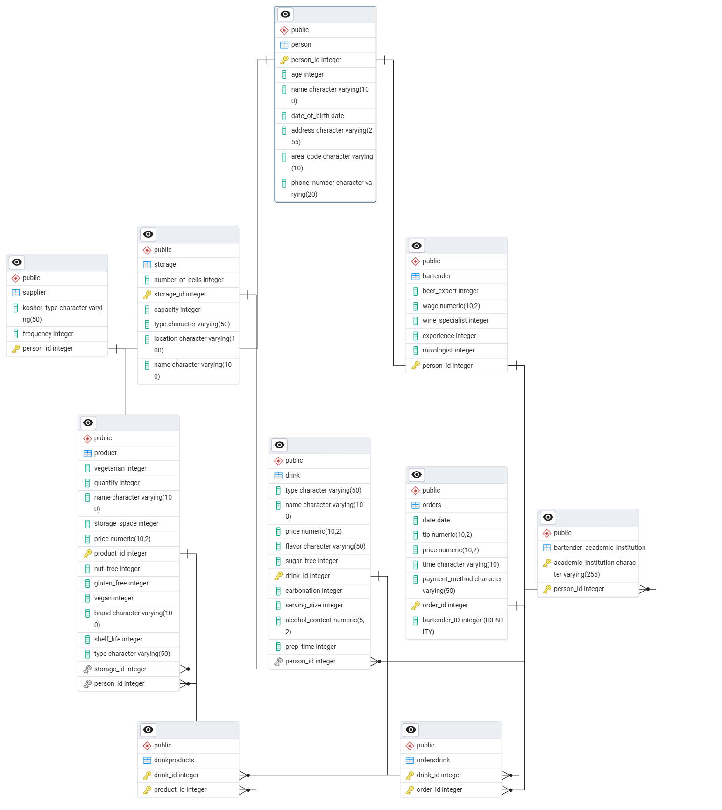

# 🍻 מערכת לניהול בר – פרויקט בסיסי נתונים (שלב א')

## 📌 סקירה כללית

הפרויקט עוסק בבניית מערכת לניהול הפעילות הפנימית של בר, תוך שימוש בבסיס נתונים יחסיים. המערכת כוללת ניהול עובדים, לקוחות, ספקים, מלאי והזמנות. הנתונים נשמרים באופן עקבי ומנורמל, ונבנו כלים המאפשרים להזין, לגבות ולשחזר את הנתונים.

---

## 🧾 פרטי ההגשה – שלב א'

- **שמות מגישים:** יוסף חפץ, יהודה גודפרי  
- **שם המערכת:** מערכת לניהול בר  
- **היחידה הנבחרת:** ניהול הזמנות וספקים  

---

## 📚 תוכן העניינים

1. [מבוא](#מבוא)  
2. [תיאור מילולי של המערכת](#תיאור-מילולי-של-המערכת)  
3. [תרשים ERD](#תרשים-erd)  
4. [תרשים DSD](#תרשים-dsd)  
5. [החלטות עיצוב](#החלטות-עיצוב)  
6. [שיטות הכנסת נתונים](#שיטות-הכנסת-נתונים)  
7. [גיבוי ושחזור נתונים](#גיבוי-ושחזור-נתונים)  

---

## 🧩 מבוא

המערכת שואפת לנהל את כלל היבטי הפעילות בבר – עובדים, לקוחות, מוצרים, ספקים, הזמנות ומלאי. באמצעות בסיס הנתונים, נשמרת עקביות בין הישויות השונות, ונבנה ממשק נוח לשליפה וניהול הנתונים.

---

## ✍️ תיאור מילולי של המערכת

### הישויות המרכזיות:
- **Person** – טבלת בסיס לכל סוגי האנשים (לקוחות, ברמנים, ספקים), כולל פרטי זהות, גיל, כתובת, טלפון ותאריך לידה.
- **Bartender** – עובדים מסוג ברמן, עם תאריכי עבודה, שכר ומשמרות.
- **Supplier** – ספקי מוצרים לבר, כולל פרטי התקשרות.
- **Orders** – הזמנות של לקוחות, עם קשר לברמן שטיפל בהזמנה והמוצרים שנבחרו.
- **Storage** – מלאי המוצרים בבר, כולל כמויות, תאריכי תפוגה, ומיקום.
- **Product** – רשימת המוצרים האפשריים להזמנה, כולל סוג, נפח ומחיר.

### מטרות עיקריות:
- ניהול עובדים ולקוחות
- תיעוד מלאי והזמנות
- יצירת דוחות ניהוליים
- גמישות בהכנסת נתונים (ידני, אוטומטי, קובץ CSV)
- שמירה על שלמות ותקינות נתונים באמצעות קשרים בין טבלאות

---

## 🗺️ תרשים ERD
  
> 

---

## 🧾 תרשים DSD

> 
> 
---

## 🧠 החלטות עיצוב

- **נרמול:** כל הטבלאות מנורמלות לצורת 3NF למניעת כפילויות.
- **שימוש במפתחות זרים:** לקשר בין טבלאות כמו Orders, Bartender ו־Product.
- **יישות אחידה לאנשים:** טבלת `Person` משמשת בסיס לכל הסוגים (באמצעות שדות ייחודיים).
- **שימוש בתאריכים:** בכל טבלה יש לפחות שני שדות מסוג תאריך (למשל: תאריך הזמנה, תאריך טיפול).
- **חלוקה לקבצי SQL נפרדים:** לפישוט העבודה – יצירה, הכנסת נתונים, מחיקה, ושליפה.

---

## 📥 שיטות הכנסת נתונים

### שיטה 1: הכנסת נתונים ידנית בקובץ CSV  

### שיטה 2: יבוא נתונים מקובצי SQL בעזרת mockaroo  

### שיטה 3: יצירת נתונים אוטומטית בפייתון עם `random` ו־`names`  

---

## 💾 גיבוי ושחזור נתונים

### גיבוי נתונים (Dump):

### שחזור נתונים (Restore):

---

## 📁 מבנה הקבצים

